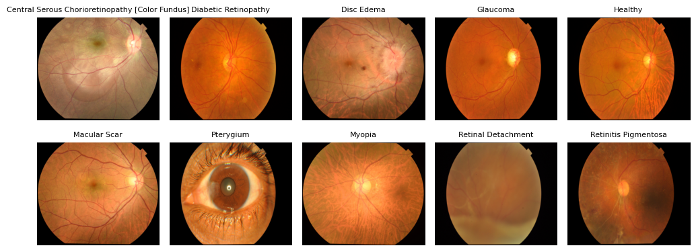
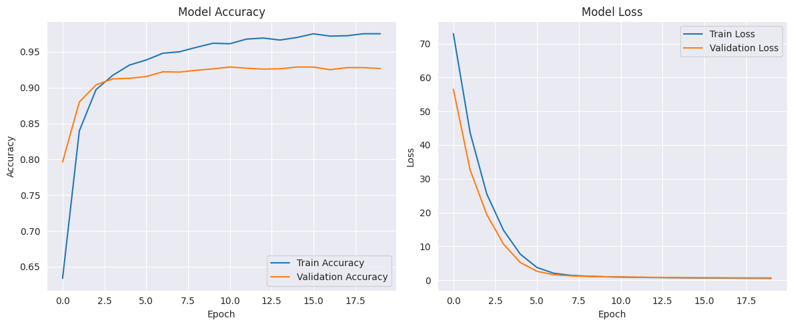
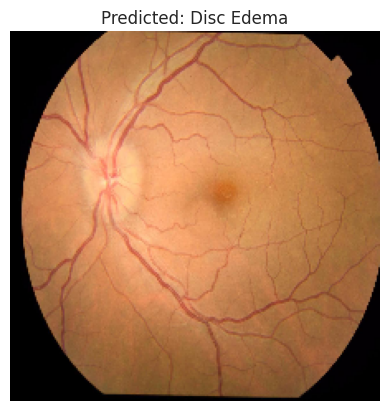
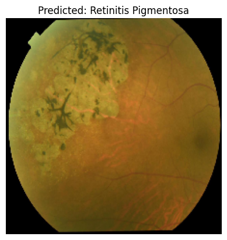
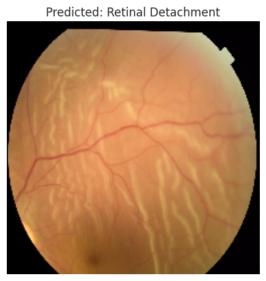
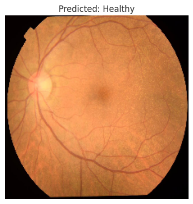

# Eye Diseases Classification 👁️
## Introduction
Eye diseases are a leading cause of visual impairment and blindness worldwide, affecting millions of people and significantly reducing their quality of life. Conditions such as diabetic retinopathy, glaucoma, age-related macular degeneration, and cataracts often develop gradually, with symptoms going unnoticed until irreversible damage has occurred. Early and accurate diagnosis is therefore critical for timely intervention and vision preservation.
With the rapid advancements in technology, particularly in artificial intelligence, modern techniques like machine learning and deep learning have become vital tools in enhancing healthcare quality. These technologies offer innovative solutions for medical diagnosis, enabling more efficient and accurate detection of eye diseases. This project focuses on developing a system for classifying eye diseases, aiming to assist ophthalmologists in identifying and distinguishing between common eye conditions more effectively and precisely.

## Problem Statement
Despite the critical importance of early diagnosis, many eye diseases remain undetected until they reach advanced stages, often leading to irreversible vision loss or blindness. There is a growing need for an automated, reliable, and efficient system that can assist in the early detection and classification of common eye diseases. This project aims to address this gap by developing a system using a deep learning capable of accurately classifying eye diseases from retinal images.

## Dataset
The dataset has 10 clasess: Diabetic Retinopathy, Glaucoma, Macular Scar, Optic Disc Edema, Central Serous Chorioretinopathy (CSCR), Retinal Detachment, Retinitis Pigmentosa, Myopia,Pterygium , and Healthy. The total of images 5335  were collected from Anwara Hamida Eye Hospital in Faridpur and BNS Zahrul Haque Eye Hospital in Faridpur district with the help of the hospital authorities. Then from these original images, a total of 15090 augmented images are produced by using brightness to adjusts the brightness of the input image to increase the number of data to make the dataset balance. The dataset can be downloaded here: https://data.mendeley.com/datasets/s9bfhswzjb/1
### Example 

 

## Model
The model is a deep learning architecture built for multi-class image classification. We use a pre-trained DenseNet121 as its feature extractor, which allows it to benefit from the rich feature representations learned from the large-scale ImageNet dataset. The input to the model is an image with shape (224, 224, 3), representing a standard-sized RGB image.
On top of the DenseNet121 base, the model includes normalization, dense layers, dropout for regularization, and a final softmax layer to classify the images into multiple categories. It is compiled with categorical cross-entropy loss and optimized using the Adamax optimizer with a low learning rate, ensuring stable convergence during training.
This design enables the model to effectively learn complex patterns in medical images while maintaining good generalization to new data.

## Results
The model was trained over 20 epochs, and the performance metrics at the final epoch indicate strong learning and generalization on the eye disease classification task:

Training Accuracy: 97.49%

Validation Accuracy: 92.67%

Test Accuracy: 92.91%

These results suggest that the model has effectively learned the features from the training data while maintaining strong generalization to unseen data. The close alignment between validation and test accuracy reflects a well-trained and balanced model with no overfitting.

### Prediction
 
 

## Conclusion
The system, powered by a deep learning model, successfully classified 10 types of eye diseases with high accuracy. Achieving a training accuracy of 97.49%, validation accuracy of 92.67%, and test accuracy of 92.91%, the results demonstrate that the model is both effective and reliable. The system performs accurately and shows strong generalization on unseen data. This highlights the potential of deep learning in supporting early detection and diagnosis of eye diseases, ultimately contributing to improved patient care.

## Demo
https://huggingface.co/spaces/Yousef20/SAIC-eye-classify
